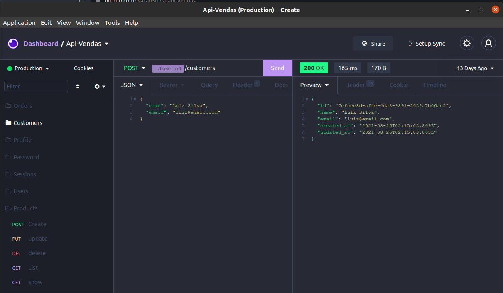
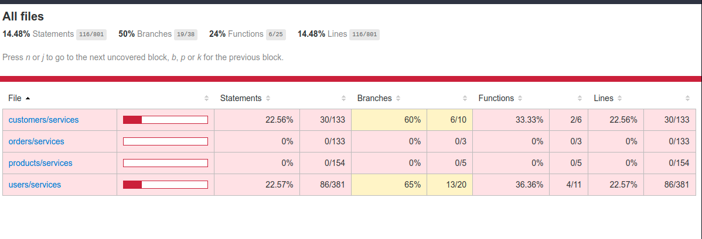
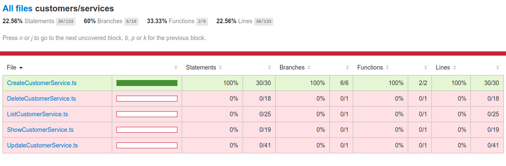
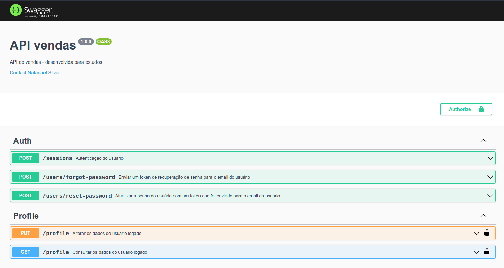
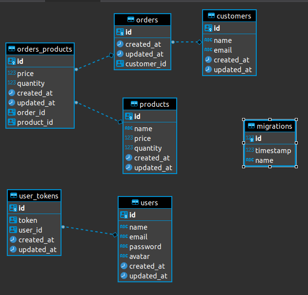

<h1 align="center">API vendas</h1>

🔍 Navegação dentro do Readme. 

  

  <h1 id="sobre-o-projeto"> ✅ Sobre o projeto </h1>
  

    Este projeto é uma API Restfull de vendas que está sendo feita para por em prática os conhecimentos das tecnologias no backend.
    As funcionalidades presentes são, cadastrar usuários, clientes, pedidos dos clientes e cadastrar produtos.
    O projeto foi desenvolvido com Design Patterns seguindo alguns dos princípios do SOLID, desacoplando totalmente a regra de negócio dos dados de infraestrutura, como por exemplo: (typeorm, repository, entity, http-routes, controllers), possibilitando fácil manutenção e troca de ORMs. Usamos também algumas libs como <a href="https://www.npmjs.com/package/tsyringe">tsyringe</a> que permite a criação de injeção de dependência que é muito util para mater o código desacoplado. Assim como a lib <a href="https://github.com/animir/node-rate-limiter-flexible">rate-limiter-flexible</a> que serve para prevenir ataques de força bruta e entre outras...
  

  

    O projeto foi hospedado em um droplet Docker 19.03.12 no Ubuntu 20.04 na <a href="https://www.digitalocean.com/">Digital ocean</a>, foi usado também <a href="https://certbot.eff.org/">Certbot</a> para gerar o certificado SSL, onde podemos testar API com a documentação do swagger <a href="#swagger">aqui.</a> E para configuração de DNS foi utilizado o servicos da <a href="https://www.cloudflare.com/pt-br/">Cloudflare</a> e a biblioteca <a href="https://www.nginx.com/">Nginx</a> para fazer proxy reverso e habilitar comunicação externa.

   

No projeto temos duas branches, a master e a main. A branch master é uma evolução do branch main onde tem toda estrutura do desenvolvimento com Design Patterns e principios SOLID.

  

 

 

  <h1 id="techs">🚀 Principais tecnologias e Serviços utilizados </h1>

  

    ➡ <a href="https://insomnia.rest">Insominia</a> para testar a api feita.
  

  

    ➡ <a href="https://typeorm.io/#/">Typeorm</a> para conectar com diversos bancos de dados.
  

  

   ➡ <a href="https://docs.docker.com/compose/">Docker-compose</a> para utilizar container do Redis e postgresql .
  

  

    ➡ <a href="https://redis.io/">Redis</a> para fazer cache da aplicação .
  

  

    ➡ <a href="https://aws.amazon.com/pt/ses/">SES da AWS</a> para envio de email.
  

  

    ➡ <a href="https://aws.amazon.com/pt/s3/?did=ft_card&trk=ft_card">s3 da AWS</a> para serviço de upload.
  

  

    ➡
    <a href="https://www.zoho.com/pt-br/mail/">Zoho E-mail</a> E-mail profissional
  

  

    ➡ <a href="https://github.com/scottie1984/swagger-ui-express">swagger-ui-express</a> para documentar e testar api.
  

  

    ➡ <a href="https://github.com/scottie1984/swagger-ui-express">Jest</a> para testes automatizados
  

    

    ➡
    <a href="https://www.digitalocean.com/">Digital ocean</a> para hospedar a plicação
  

      

    ➡
    <a href="https://www.cloudflare.com/pt-br/">Cloudflare</a> para configuração de dns
  

  

    ➡
    <a href="https://registro.br/login/?session=required">Registro.br</a> para compra de dominio
  

  

    ➡
    <a href="https://certbot.eff.org/">Certbot</a> Certificado ssl com <a href="https://letsencrypt.org/pt-br/">letsencrypt</a>
  

    

    ➡
    <a href="https://www.nginx.com/">Nginx</a> para fazer o proxy reverso
  

  

    ➡
    <a href="https://www.typescriptlang.org">Typescript</a>
  

  

    ➡
    <a href="https://www.typescriptlang.org">PostgresSQL</a>
  

  

    ➡
    <a href="https://nodejs.org/en/"> NodeJS</a>
  

 
 
 

  <h1 id="rodar-projeto">💻 Para rodar o projeto na sua maquina</h1>
  
➡ Instalar o NodeJS na sua máquina. 

  
➡ Vá no cmd dele(no Vscode o nome é "terminal") ou abra o cmd da sua máquina, digite e execute: 

  

    git clone https://github.com/NatanSiilva/api-vendas.git

  

   

  
➡ Entre na pasta do projeto(a que acabou de clonar), digite e execute: 

  

    yarn

  

   
  
Pronto, agora que temos todas as dependencias instaladas podemos configurar arquivo .env.

  

    APP_SECRET= Aqui vai uma hash da sua escolha
    APP_API_URL=http://localhost:3333 Url para cessar a aplicação
    APP_WEB_URL=http://localhost:3000 Url para testar o email fake Ethereal
    REDIS_HOST= pode ser configurado no arquivo docker-comose.yml
    REDIS_PORT= Pode ser configurado no arquivo docker-comose.yml
    REDIS_PASS= pode ser configurado no arquivo docker-comose.yml

    # Mail config: ethereal or ses
    MAIL_DRIVER=ses

    # Storage Config: disk or s3
    STORAGE_DRIVER=disk

    # AWS Credentials
    # Nessa configuração você vai ter que criar uma conta na aws
    AWS_REGION=us-east-1
    AWS_ACCESS_KEY_ID=
    AWS_SECRET_ACCESS_KEY=

  

  <strong>OBS:</strong> para que você venha utilizar rota POST/users/forgot e POST/users/reset você precisa criar uma conta na AWS e fazer algumas configurações com SES (Amazon Simple Email Service), onde só é possível testar com um e-mail verificado. Em breve estarei fazendo um artigo sobre, enquanto isso não acontece fico a disposição para ajudar.

   

  

   Depois de configurar o .env, precisamos apenas renomear o ormconfig.example.json para ormconfig.json e executar o seguinte comando:
  

   

    docker-compose up - para iniciar o container do postgresql e redis.

    docker-compose stop - para parar o processo

    docker-compose down - para excluir os container

   

  
❤ Pronto, seu projeto está certinho para funcionar.

  
 Algum erro? Contate-me. 

   

 
 
 

  <h1 id="data-base">🔗Testes automatizados</h1>

  
Para rodar os teste basta executar o comando yarn test, OBS: os testes não estão 100% concluidos. Para ver o andamento dos teste da aplicação em porcentagem como ta na imagem abaixo, vá na pasta coverage na raiz do projeto e no arquivo index.html clique com o botão direito e selecionar a opção <strong>Open With Live Serve</strong> que vai abrir uma tela no browser com as informações dos testes.

  

    yarn test

  

  
    
    

  

 
 
 

 <h1 id="testar-api">Swagger Documentação</h1>

   

    Você pode ta utilizado a documentação no <a href="https://apivendas.natandev.com.br/api-docs/#/">swagger</a> e na rota POST /users, bastar criar um usuário com name, email e password. Em seguida se autenticar na rota POST /sessions. Logo a pois a autenticação vai retornar um objeto e dentro dele vai ter um campo token, é só copiar o token e na parte superior da página vai ter um cadeado com o nome Authorize, é só clicar nele e colar o token e você vai ta pronto para testar todas as rotas.

  

    {
      "name": "Lucas05",
      "email": "lucas05@email.com",
      "password": "123456"
    }

  

   
    

  

 
 
 

  <h1 id="data-base">🔗 Estrutura do banco de dados</h1>

  

 
 
 

  <h1 id="contribuir">🔗 Como contribuir com o projeto</h1>
  

    
 1° - Faça um Fork do repositório; 

    
 2° - Clone o repositório; 

    
 3° - Crie uma branch com a sua feature; 

    
 4° - Faça um commit bem descritivo com suas mudanças; 

    
 5° - Dê 'Push' a sua branch; 

    
 6° - Ir em Pull Requests do projeto original e criar uma pull request com o seu commit; 

    

     ➡ Caso tenha dúvidas sobre como criar um pull request,
      <a
        href="https://docs.github.com/pt/github/collaborating-with-issues-and-pull-requests/creating-a-pull-request"> clique neste link.
      </a>
    

  

 
 
 

## 📝 Licença

Este projeto esta sobe a licença MIT. Veja a [LICENÇA](https://opensource.org/licenses/MIT) para saber mais.

Feito com ❤️ por Natanael Silva 👋🏽

